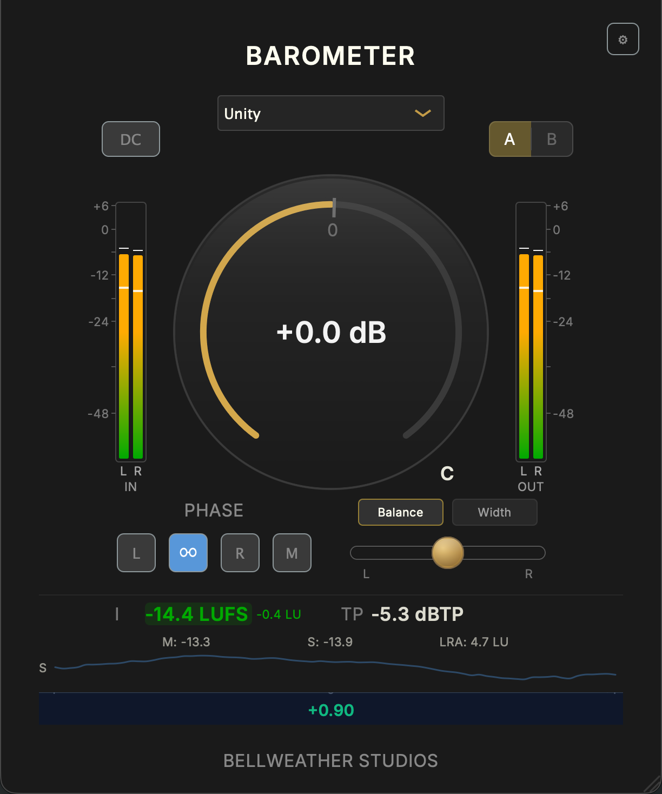

# Bellweather Audio Core

Bellweather Audio Core is an open-source C++ audio-core library from
**Bellweather Studios**: BS.1770 / EBU Tech 3341 metering, framework-neutral
DSP/core modules, real-time-safety utilities, and **Barometer** as a
source-built JUCE reference plugin.

This is not a prebuilt plugin download. The libraries are the point; Barometer
shows how the library surface is adapted into JUCE without making JUCE the
center of the reusable architecture. The loudness/true-peak conformance suite
ships with the source, so the correctness claims below are ones you can run,
not ones you have to take on trust.

<p align="center">
  
</p>

This repository contains reusable library source and the Barometer reference
plugin source needed to exercise that library in a real JUCE plugin. It does not
ship prebuilt Barometer binaries, installers, signing artifacts, notarization
artifacts, or end-user plugin packages. Bellweather product services, commercial
product DSP, installers, and unreleased product code are outside this source
release.

## Public Scope

This tree is intentionally narrow:

- **Stable reusable API:** metering, DSP primitives, audio value types,
  real-time-safety helpers, FFT support, and framework-neutral ports.
- **Barometer reference-plugin support:** the JUCE adapter, UI, preset, and
  example support needed to build the Barometer source plugin locally.
- **Not included:** commercial product services, certification helpers,
  licensing/update services, installers, prebuilt plugin binaries,
  signing/notarization artifacts, and unreleased plugin code.

With `BWS_BUILD_BAROMETER_PLUGIN=OFF`, consumers get 9 standalone library-mode
targets that do not link JUCE. Enabling Barometer adds the preset support,
JUCE adapter, UI, example support, and shipped UI sub-library targets required
for the plugin source build. Those Barometer-support targets are included so the
reference plugin can be built and inspected from source, not as an end-user
plugin distribution path.

## Positioning

Use this project as a source release for reusable audio libraries. The public
proof is the library surface: public-surface compile/link checks, JUCE separation
validation, manifest coverage, and standards-oriented metering tests.

Barometer is included as source-built reference plugin code. Bellweather Audio
Core v1.0.0 does not publish prebuilt Barometer VST3/AU binaries, installers,
codesigned artifacts, notarized packages, or redistributable plugin bundles.

## Quickstart (Docker - no toolchain setup)

The fastest way to build the libraries, prove the public module targets are
consumable, and watch the loudness/true-peak conformance suite pass - **no
compiler, CMake, or audio setup on your machine.**
You only need [Docker Desktop](https://www.docker.com/products/docker-desktop).

From any terminal:

```sh
git clone https://github.com/keithhetrick/bellweather-audio-core.git
cd bellweather-audio-core
docker build -t bellweather-audio-core .      # builds the image, ~2 min (needs internet)
docker run --rm bellweather-audio-core        # runs the proofs
```

You should see the conformance tests pass and a final line:

```text
  Bellweather Audio Core: public surface + conformance + JUCE separation + library suites PASSED
```

That's it - you just built the reusable library surface, proved the documented
public module targets link from a downstream project, and verified the
metering behavior against the published BS.1770/EBU reference values. To build
on a native toolchain instead (or to build the Barometer JUCE plugin), see
**Build** below.

### Docker build lanes

The shipped `Dockerfile` exposes the Linux library proof and the optional
Barometer source-built reference plugin lane:

| Lane                | Compiler | What it verifies                                                                               |
| ------------------- | -------- | ---------------------------------------------------------------------------------------------- |
| `clang-fetch`       | Clang    | Libraries, public-surface smokes, metering conformance, JUCE-separation check; fetches Catch2. |
| `gcc-fetch`         | GCC      | Libraries, public-surface smokes, metering conformance, JUCE-separation check; fetches Catch2. |
| `gcc-system-catch2` | GCC      | Same library proof using Ubuntu's `catch2` package with test fetching off.                     |
| `barometer-clang`   | Clang    | Barometer VST3 source build with JUCE fetched by CMake. This is not a binary release lane.     |

Run the default Linux library lanes:

```sh
tools/docker_lanes.sh
```

Run the optional Barometer source-build lane too:

```sh
RUN_PLUGIN_LANES=1 tools/docker_lanes.sh
```

The lane runner prints `Docker lane N/M`, elapsed time, and a heartbeat while a
Docker build or container check is still running. The default lanes are Linux
clean-room library proof only; they do not prove native macOS or native Windows
builds. The Barometer lane is longer because it fetches JUCE and compiles a real
VST3 plugin target.

Run one lane:

```sh
docker build --target gcc-system-catch2 -t bellweather-audio-core:gcc-system-catch2 .
docker run --rm bellweather-audio-core:gcc-system-catch2
```

## Who this is for

- JUCE developers who want a reference architecture for keeping DSP/core logic
  out of the plugin-framework layer.
- Plugin developers who want conformance-tested loudness and true-peak metering
  they can read, run, and reuse.
- Developers studying real-time-safe audio-thread design in a production-style
  plugin codebase.

## What you can verify

- **Integrated loudness** - ITU-R BS.1770-4/5 and EBU R128, checked against the
  EBU Tech 3341 published target values.
- **True-peak** - BS.1770-5 §3.5 with 4× oversampling, checked against the
  Nielsen/Lund inter-sample analytic bound.
- **Loudness range (LRA)** - EBU Tech 3342.
- **Sample-rate correctness** - 44.1, 48, 88.2, 96, 176.4, and 192 kHz, each
  matched to the 48 kHz reading, where the meter uses the published BS.1770
  coefficient table verbatim.
- **Allocation-free metering** - `Bs1770Meter::process()` and
  `TruePeakMeter::process()` are covered by audio-thread allocation tests;
  `Bs1770Meter` is additionally checked across sub-block sizes.
- **JUCE separation** - the reusable core modules stay below the JUCE adapter
  layer; Barometer uses JUCE through `bw_juce_adapters`.

### Measurement references

These checks use broadcast/audio metering references because they give independent
targets for the code to hit:

| Reference                                                                                                                       | What it is                                                                                              | What this project uses it for                                                                        |
| ------------------------------------------------------------------------------------------------------------------------------- | ------------------------------------------------------------------------------------------------------- | ---------------------------------------------------------------------------------------------------- |
| [ITU-R BS.1770](https://www.itu.int/rec/R-REC-BS.1770)                                                                          | The international recommendation for objective programme loudness and true-peak level.                  | K-weighted loudness, absolute/relative gating, integrated LUFS, and true-peak measurement.           |
| [EBU R 128 / EBU loudness](https://tech.ebu.ch/loudness)                                                                        | The European broadcast loudness practice built on BS.1770.                                              | Human-facing terms: Momentary, Short-term, Integrated, LUFS, LU, LRA, and EBU Mode expectations.     |
| [EBU Tech 3341](https://tech.ebu.ch/publications/tech3341)                                                                      | The EBU Mode loudness-metering specification and test-signal set.                                       | Published conformance targets for loudness and true-peak test cases.                                 |
| [EBU Tech 3342](https://tech.ebu.ch/publications/tech3342)                                                                      | The EBU loudness-range descriptor.                                                                      | LRA calculation and stability behavior.                                                              |
| [AES true-peak overview](https://aes.org/resources/audio-topics/loudness-project/learn-more/)                                   | Public background on inter-sample peaks: peaks that occur between stored samples during reconstruction. | Why true-peak meters upsample before measuring peaks.                                                |
| [Nielsen/Lund, "Overload in Signal Conversion"](https://www.semanticscholar.org/paper/ab1206497afbc620f48e893bcb6239b4653b7a8f) | Audio Engineering Society research context for inter-sample overload in conversion paths.               | The fs/4 stress signal and the +3.0103 dB inter-sample peak bound used to verify true-peak behavior. |

BS.1770 and the EBU documents are industry standards because they let different
meters, broadcasters, DAWs, plugins, and QC systems agree on the same loudness
and true-peak readings. Nielsen/Lund is not a standards body; it is included
because it gives a useful analytic stress case for a known true-peak failure mode.

Metric names in the tests map to those references:

| Metric             | Meaning                                                                                                                         |
| ------------------ | ------------------------------------------------------------------------------------------------------------------------------- |
| `LUFS`             | Loudness Units relative to digital full scale. More negative is quieter; `-23 LUFS` is the EBU R 128 broadcast reference level. |
| `LU`               | Relative loudness difference. A 1 LU change is a 1 dB loudness change.                                                          |
| `Integrated` / `I` | Loudness measured over the full programme after BS.1770 gating.                                                                 |
| `Momentary` / `M`  | Loudness over a 400 ms window.                                                                                                  |
| `Short-term` / `S` | Loudness over a 3 s window.                                                                                                     |
| `LRA`              | Loudness Range: the gated spread of short-term loudness, in LU.                                                                 |
| `dBTP`             | Decibels true peak, referenced to digital full scale after inter-sample peak estimation.                                        |

```sh
cmake -S . -B build -DBUILD_TESTING=ON -DBWS_BUILD_BAROMETER_PLUGIN=OFF
cmake --build build --target bw_dsp_metering_tests bw_public_surface_compile_tests
ctest --test-dir build -L public-surface --output-on-failure   # public target consumption
ctest --test-dir build -R bw_dsp_metering --output-on-failure   # BS.1770 / EBU conformance
ctest --test-dir build -L framework-boundary --output-on-failure   # JUCE separation
```

Or use the library preset:

```sh
cmake --preset library
cmake --build --preset library
ctest --test-dir build-library --output-on-failure
```

`-DBWS_BUILD_BAROMETER_PLUGIN=OFF` configures the reusable libraries, public
surface smokes, and conformance suite with the plugin adapter layer disabled.
The library suite needs CMake, Python 3, a C++20-capable compiler, and Catch2.
Catch2 is fetched from GitHub at configure time unless a system copy is found
(`find_package(Catch2 3)`). Reference signals are generated deterministically
during the test build. Set `BWS_BUILD_BAROMETER_PLUGIN=ON` to build the
Barometer source plugin locally; that path fetches JUCE and builds the plugin
lane with the stricter UI/plugin standard. See
[TESTING.md](TESTING.md) for how each test maps to the specs.

Native Windows proof is covered by the public `windows-latest` MSVC CI job. For
Apple Silicon local preflight, see
[`docs/WINDOWS_ARM64_PARALLELS.md`](docs/WINDOWS_ARM64_PARALLELS.md); that lane
proves Windows ARM64/MSVC in a Parallels VM.

**Fully offline test builds:** install Catch2 v3 first (e.g. `brew install catch2`,
`apt-get install catch2`, or `vcpkg install catch2`), then configure with
`-DBWS_FETCH_TEST_DEPS=OFF` to forbid the network fetch and fail fast if it is
missing.

## What's here

- **Loudness metering** - LUFS (integrated / short-term / momentary), true-peak,
  and loudness range, with the conformance suite above.
- **Framework-neutral DSP/core libraries** - signal processing and foundation
  code live below the plugin adapter layer, so the primitives are reusable
  outside the plugin framework.
- **Barometer reference plugin** - a transparent gain + metering utility plugin
  (VST3 / AU) built entirely on the above and shipped as source, not binaries.

## Architecture

One rule defines the repo: **JUCE is the plugin framework adapter, not the DSP
substrate.** The reusable library code below that adapter line is plain C++ you
can reuse, test, and verify as a library; `ctest -L framework-boundary` checks
that separation.

```text
 ┌───────────────────────────────────────────────────────────────────┐
 │  Barometer plugin               plugins/production/BwsBarometer/  │  VST3 / AU
 └──────────────────────────────────┬────────────────────────────────┘
                                    │ uses
 ┌──────────────────────────────────▼────────────────────────────────┐
 │  Host-adapter layer       -     JUCE integration lives here       │
 │    bw_juce_adapters   wraps juce::AudioProcessor, buffers, APVTS  │
 │    bw_ports           framework-agnostic plugin interfaces        │
 └──────────────────────────────────┬────────────────────────────────┘
                                    │ no juce:: type crosses this line
 ┌──────────────────────────────────▼─────────────────────────────────┐
 │  Framework-neutral core    checked by: ctest -L framework-boundary │
 │    bw_dsp_metering   BS.1770 / EBU loudness · true-peak · LRA      │
 │    bw_dsp_core       DSP primitives                                │
 │    bw_dsp_processors small reusable channel/stereo processors      │
 │    bw_fft_adapters   portable/accelerated FFT boundary             │
 │    bw_rt             real-time-safety (guards, lock-free queue)    │
 │    bw_audio_types · bw_state_types · bw_core    value types        │
 └────────────────────────────────────────────────────────────────────┘
```

A consumer links the core modules directly (`bws::bw_dsp_metering`, …) and pulls
only their declared dependency closure; the Barometer plugin adds the JUCE
adapter layer on top. See [`docs/ARCHITECTURE.md`](docs/ARCHITECTURE.md) for
the layer map, invariants, thread model, and design choices behind that line.

## Use as a library

The simplest consumption path is `add_subdirectory` plus the `bws::` alias
targets. The reusable library surface can also be installed/exported as a CMake
package for `find_package(BellweatherAudioCore)`. See
[`docs/USING_AS_A_LIBRARY.md`](docs/USING_AS_A_LIBRARY.md) for both paths; the
short `add_subdirectory` version:

```cmake
add_subdirectory(bellweather-audio-core)
target_link_libraries(my_plugin PRIVATE bws::bw_dsp_metering bws::bw_dsp_core)
```

The namespaced `bws::` targets are the public CMake contract. Raw target names
such as `bw_dsp_metering` are local build targets used to define the libraries;
consumer projects should link the `bws::` aliases shown in the docs.

## API documentation

Every public header is documented inline. To generate browsable HTML API docs:

```sh
doxygen Doxyfile     # writes docs/api/html/index.html
```

The headers themselves are the canonical reference - each carries its
real-time-safety, allocation, and thread-safety contract in its doc-comment.
See [`docs/PUBLIC_API_CONTRACT.md`](docs/PUBLIC_API_CONTRACT.md) for the
stability guarantees behind those headers.

## Build

### Libraries + conformance suite

This path leaves the plugin adapter layer off. It needs CMake >= 3.22, a
C++20-capable compiler, Python 3, and Catch2 (found via `find_package`,
otherwise fetched at configure time). The public CI runs the same library preset
on Linux, macOS, and native Windows/MSVC. On Linux, install the build tools
before configuring:

```sh
sudo apt-get install -y build-essential cmake ninja-build python3   # Linux only

cmake -S . -B build -DBUILD_TESTING=ON -DBWS_BUILD_BAROMETER_PLUGIN=OFF
cmake --build build --target bw_dsp_metering_tests bw_public_surface_compile_tests
ctest --test-dir build -L public-surface --output-on-failure
ctest --test-dir build -R bw_dsp_metering --output-on-failure
ctest --test-dir build -L framework-boundary --output-on-failure
```

Equivalent preset:

```sh
cmake --preset library
cmake --build --preset library
ctest --test-dir build-library --output-on-failure
```

### Barometer source-built reference plugin (macOS)

Builds local VST3 / AU plugin artifacts from source. Requires Python 3 (with
`fonttools`) and Ninja; JUCE is fetched automatically at configure time. This
section is for local reference-plugin builds, not for downloading or publishing
prebuilt plugin binaries.

```sh
cmake --preset default      # configure (VST3 + AU, RelWithDebInfo)
cmake --build --preset default
```

The built plugin lands under
`build/plugins/production/BwsBarometer/BwsBarometer_artefacts/`.

### Configure options

Pass any of these with `-D`, e.g. `cmake -S . -B build -DBWS_BUILD_BAROMETER_PLUGIN=OFF`:

| Option                       | Default   | Effect                                                                              |
| ---------------------------- | --------- | ----------------------------------------------------------------------------------- |
| `BWS_BUILD_BAROMETER_PLUGIN` | `OFF`     | Build the reusable libraries only. Set `ON` for the Barometer source-build lane.    |
| `BUILD_TESTING`              | `ON`      | Build the test targets. Set `OFF` when consuming the modules as a library.          |
| `BWS_FETCH_TEST_DEPS`        | `ON`      | Fetch Catch2 v3 when not found. Set `OFF` to require a system Catch2 and fail fast. |
| `BWS_ENABLE_CXX_MODULES`     | `OFF`     | Opt into C++ named-module file sets when the toolchain supports them.               |
| `BWS_JUCE_FETCH`             | `ON`      | Allow the pinned JUCE download via FetchContent (plugin path only).                 |
| `BWS_OSX_ARCHITECTURES`      | _(unset)_ | macOS universal build, e.g. `-DBWS_OSX_ARCHITECTURES="x86_64;arm64"`.               |

## Platform support

The reusable libraries, public-surface smokes, and conformance suite build on
**Linux, macOS, and native Windows/MSVC** through the public CI matrix (see
[`.github/workflows/conformance.yml`](.github/workflows/conformance.yml)).
Barometer is shipped as source-built reference plugin code, not as a prebuilt
binary release.

## Troubleshooting

| Symptom                                                      | Cause and fix                                                                                                                                                                           |
| ------------------------------------------------------------ | --------------------------------------------------------------------------------------------------------------------------------------------------------------------------------------- |
| `Catch2 not found` / `Failed to clone … Catch2.git`          | No internet during configure. Install Catch2 v3 (`brew install catch2`, `apt-get install catch2`, `vcpkg install catch2`) and add `-DBWS_FETCH_TEST_DEPS=OFF`, or reconnect and retry.  |
| `cannot allocate memory` while compiling JUCE (Docker)       | JUCE's unity translation units are RAM-heavy. Give Docker Desktop ≥ 6 GB (Settings → Resources) and/or build with fewer jobs: `cmake --build … --parallel 2`.                           |
| C++ standard errors in the library lane                      | Use a C++20-capable compiler. The reusable library preset builds at C++20; the Barometer source-plugin lane may require the newer UI/plugin toolchain exercised by local plugin builds. |
| `ninja: error: unknown target 'bw_dsp_metering_tests'`       | `BUILD_TESTING` is off. Re-configure with `-DBUILD_TESTING=ON`.                                                                                                                         |
| The first plugin configure is slow                           | It downloads the pinned JUCE once; later configures reuse the cache.                                                                                                                    |
| macOS: a locally built downloaded plugin won't load in a DAW | Unsigned local builds can inherit quarantine from the source archive. Clear it for local testing: `xattr -dr com.apple.quarantine Barometer.vst3`.                                      |

For the zero-setup path that sidesteps all of the above, see the **Quickstart (Docker)** section at the top.

## Layout

```text
bellweather-audio-core/
├── README.md                 you are here
├── Dockerfile                zero-setup quickstart + Linux build lanes
├── docs/ARCHITECTURE.md      layer map, invariants, thread model, design choices
├── modules/                  reusable libraries - link the bws::bw_* you need
│   ├── bw_dsp_metering/      LUFS · true-peak · loudness-range meters + conformance suite
│   ├── bw_dsp_core/          framework-neutral DSP primitives
│   ├── bw_rt/                real-time-safety utilities (guards, lock-free ring buffer)
│   ├── bw_audio_types/       buffer / parameter value types
│   ├── bw_ports/             framework-agnostic plugin interfaces
│   ├── bw_juce_adapters/     JUCE host-adapter layer (only JUCE-linking layer)
│   ├── bw_ui/                token-driven UI primitives (used by Barometer)
│   └── …                     bw_core, bw_state_types, bw_fft_adapters, Barometer support
├── plugins/production/BwsBarometer/   source-built reference plugin
├── cmake/                    build support (presets, plugin manifest, Catch2 helper)
├── docs/USING_AS_A_LIBRARY.md         consume the modules from your own CMake project
├── docs/MODULES.md                    module catalog: purpose, headers, deps, JUCE, maturity
├── tools/docker_lanes.sh              run every Docker build lane
├── MANIFEST.md               every shipped path and why it exists
├── TESTING.md                what the conformance suite covers + how to run it
├── LICENSING.md · CONTRIBUTING.md · SECURITY.md · SUPPORT.md · GOVERNANCE.md
├── CHANGELOG.md
└── .github/workflows/        CI - conformance · formatting · sanitizers · DCO
```

## License

Apache-2.0. See [`LICENSE`](LICENSE). Third-party components are listed in
[`THIRD_PARTY_NOTICES.md`](THIRD_PARTY_NOTICES.md), and
[`LICENSING.md`](LICENSING.md) explains in plain English how Apache-2.0 and JUCE's
terms interact for the source and for built binaries. Contributions welcome
under the DCO - see [`CONTRIBUTING.md`](CONTRIBUTING.md).

Built by Keith Hetrick · Bellweather Studios · <keith@bellweatherstudios.com>
